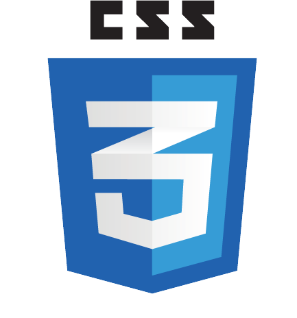

## Hello and Welcome to Muhammad Ali's Profile 👋

- :mortar_board: I'm a university student. I'm doing my **Bachelors in Computer Sceinces(BSCS)** from **FAST NUCES Karachi**.
I upload and maintain my semester projects here as a way to track my progress and growth. 
- :man_technologist: I am profficient in the understanding and solving of problems, be it real world or academic, using the C++ language and its ecosystem.
- :open_book: I have keen interest in Web development, App development and Game development. I hope to achieve mastery in these some day. 

## My Projects
#### 1. [Mordecai(FLEX 2.0)](https://github.com/M-AliTanveer/Mordecai): 
A clone of my university's Student Portal named FLEX. It was developed completely using C language and we developed extra features besides the one found in the official university's portal. The project itself had two separaate sections for the teacher and the students linked together to create a seamless University Portal To get more info about the project, its working and how it was developed, check out the repository [here](https://github.com/M-AliTanveer/Mordecai).
#### 2. [Seymour](https://github.com/M-AliTanveer/Seymour):
A Pizza shop developed using *Object Oriented Programming* Concepts and the Windows Forms Framework to provide a complete GUI experince. We emulated a fully functional Pizzeria along with a Robust and fully customizeable Menu down to each individual component of the Pizza. Check the repository [here](https://github.com/M-AliTanveer/Seymour) for more info about the project.
#### 3. [Grammar Corrector and Dictionary](https://github.com/M-AliTanveer/Grammar-Corrector):
This is a Grammar Corrector and Dictionary that me and my friends developed for our Data Structures project. The program makes use of basic **Natural Language Processing** I learned on my own within a limited timeframe. The program corrects errors in helping verb placement within a sentence and works for all tenses of the English Language. The UI was developed in Windows Forms to provide a complete and seamless GUI. Check the repository [here](https://github.com/M-AliTanveer/Grammar-Corrector) for more info about the project.
#### 4. [Full University Preparation Assistant](https://github.com/M-AliTanveer/FUPA):
A program to create and take quizzes under time constraints to prepare students for university entrance tests. It assists both students and teachers. This project is created in Intel x8086 assembly language using MASM assembler. Irvine's Library was used in the project as well as a set of Windows specific functions to enable clicking in the console for a partial GUI feel. Check out the repository [here](https://github.com/M-AliTanveer/FUPA).
#### 5. [Zephyr II: Numerical Computing and Analysis ](https://github.com/M-AliTanveer/Zephyr-2.0-Parallelized):
A GUI-based Parallel program developed completely in C++ with the use of OpenMP parallel directives. It Updates on the prior <a href="https://github.com/Fawad-Javed-Fateh/Zephyr-I>Python Script Zephyr I</a> with more updated and streamlined methodologies and parallelism based approach.

## :desktop_computer: Languages:

  
  
  
  
  
  
 

**I use the following :hammer_and_wrench: tools in my projects and general development:**

  
  
  
  
  

*My Github Stats:*

&nbsp;&nbsp;&nbsp;&nbsp;&nbsp;&nbsp;&nbsp;&nbsp;&nbsp;&nbsp;&nbsp;&nbsp;&nbsp;&nbsp;&nbsp;&nbsp; 

